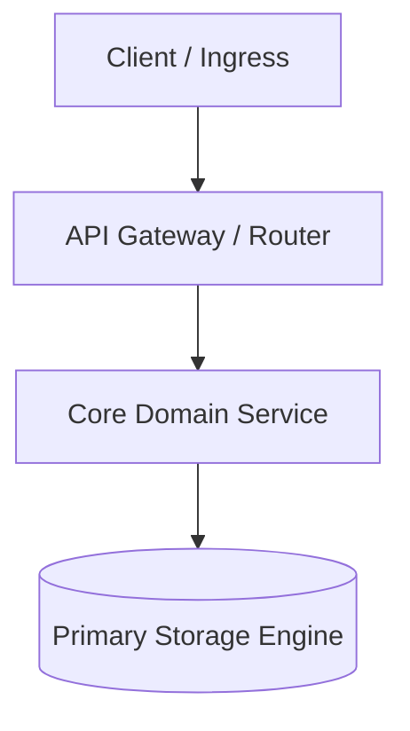

# Architecture Deep-Dive: [Topic Name]

- **Status**: Active | Draft | Deprecated
- **Parent Reference**: [ARCHITECTURE.md](../../ARCHITECTURE.md)
- **Target Audience**: System Architects, Lead Engineers, and AI Coding Agents
- **Related ADRs**: [docs/decisions/0000-template.md](../decisions/0000-template.md)

## Overview & Scope
Concise summary of this topological area, system responsibilities, and architectural boundaries.

## Component Topology & Boundaries
Macro interaction diagram illustrating services, trust zones, and boundary lines (prefer Mermaid):

## Communication Protocols & Data Flow
Explicit communication channels and lifecycle interaction models:
- **Synchronous Protocols**: REST, gRPC, RPC timeouts, and connection pooling.
- **Asynchronous Messaging**: Event queues, pub/sub topics, message schema formats, and idempotency keys.
- **Payload & Serialization**: JSON, Protocol Buffers, Avro, and compression standards.

## State, Storage & Consistency Model
How state is partitioned, cached, and persisted:
- **Storage Engines**: Primary database, read replicas, key-value caches, or object stores.
- **Consistency Level**: Strong consistency (ACID), Eventual consistency, or Read-after-write.
- **Data Retention & Partitioning**: Sharding keys, table partitioning, TTL, and archiving policies.

## Resilience, Scalability & Failure Modes
Failure isolation boundaries and recovery patterns:
- **Fault Tolerance**: Circuit breakers, rate limits, backpressure handling, and graceful degradation.
- **High Availability & Redundancy**: Multi-zone replication, clustering, and leader election.
- **Disaster Recovery**: RTO (Recovery Time Objective) and RPO (Recovery Point Objective) targets.

## Security Boundaries & Trust Zones
Isolation, encryption, and authorization perimeters:
- **Network Perimeter**: Public DMZ, private VPC subnets, and ingress/egress firewalls.
- **Authentication & Identity**: mTLS, Service Accounts, JWT tokens, and SPIFFE/SPIRE identities.
- **Data Protection**: Encryption at rest (AES-256, KMS) and in transit (TLS 1.3).
