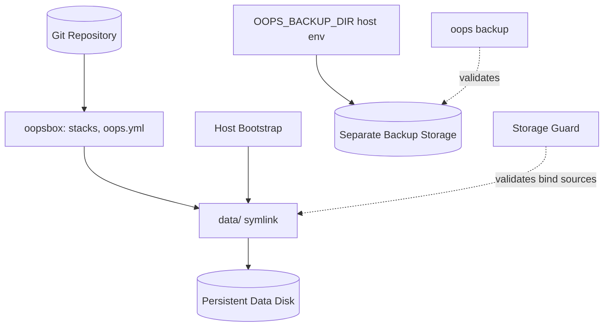

# Architecture Deep-Dive: Persistent Data and Storage Path Abstraction [สถาปัตยกรรมข้อมูลถาวรและการแยกชั้น path ของ storage]

- **Status**: Active
- **Target Audience**: System Architects, Lead Engineers, and AI Coding Agents
- **Parent**: [ARCHITECTURE.md](../../ARCHITECTURE.md)
- **Enforcement Spec**: [Storage Guard](../specs/storage-guard.md)

## Overview & Scope

An oopsbox is a Git-controlled deployment and configuration unit. Production configuration must be reproducible from the Git repository and must not depend on machine-specific paths or manual edits on the server. [config มาจาก Git ไม่ต้อง SSH ไปแก้บนเครื่อง production]

This document defines how persistent data and backups are placed so that the same repository runs unchanged on a laptop, a VM with a data disk, or a cloud host. [repo เดียวรันได้ทุกที่ โดยไม่แก้ compose]

## Core Principle

> Configuration describes logical locations. The host decides physical locations.

- Compose files reference only repository-relative paths such as `../../data/mysql`.
- No compose file, `.env`, or `oops.yml` contains a physical disk path such as `/mnt/disks/data-1`.
- The mapping from logical path to physical disk lives in one place: the `data` link created by the host bootstrap layer (`oops storage link`). Backup location is a host-local setting (`OOPS_BACKUP_DIR`). [ผูก logical -> physical ที่จุดเดียว]

## Component Topology & Boundaries

Responsibility boundaries:
- **Git (configuration)**: stacks, service definitions, `oops.yml`, priority. Never contains data or machine paths.
- **Persistent data disk (application data)**: database files, uploads, stateful volumes. Survives OS disk replacement.
- **Backup storage (backups)**: dumps and archives on storage physically separate from the data disk, selected per host by `OOPS_BACKUP_DIR`. It does not have to live inside the oopsbox and is never mounted into compose. [คนละ disk กับ data และไม่ต้องอยู่ใน oopsbox]
- **Host bootstrap (physical paths)**: formats and mounts disks, creates the `data` link. Owned by the host layer, not by the repository.
- **OS disk**: disposable. Holds nothing that cannot be rebuilt from Git, the data disk, and the backups.

## State, Storage & Consistency Model

### Placement Rules
- **Data lives under `data/`**: every bind mount for stateful services goes through `data/`, so one link controls all application data.
- **Backups are host-local and optional inside the oopsbox**: `oops backup` writes to `OOPS_BACKUP_DIR` (default `./backups`). In production point it at storage that does not share a disk with `data/`. A machine may keep backups entirely outside the oopsbox.
- **Real directory on development machines**: on a laptop `data/` is a plain directory. The same compose files work with no link.
- **Named volumes only for regenerable state**: for example Caddy certificates (`caddy_data`, `caddy_config`). Anything that cannot be regenerated belongs under `data/`.

### Why Symlinks
- A link keeps compose paths identical across machines.
- Replacing a disk or moving to a larger one changes only the link target, with no Git change and no redeploy of configuration.
- The physical path is invisible to Git review, so a disk layout change is never a repository change.

### Failure Mode Addressed
If the persistent disk is not mounted, the mount-point directory still exists on the OS disk. A stateful service would then start and silently write a fresh database to the OS disk, creating split data and a misleading healthy state. A bare "path exists" check does not detect this. [disk ไม่ mount แต่ path ยังอยู่ -> ข้อมูลไปลง OS disk เงียบ ๆ]

## Resilience, Scalability & Failure Modes

### Mount Validation
Before starting or recreating containers, the [Storage Guard](../specs/storage-guard.md) inspects every bind-mount source the target services use, not only `data/`:
- A path through a dead link is unhealthy.
- A path that resolves under a configured mount prefix (`storage.mount_prefixes`, default `/mnt`, `/media`, `/Volumes`) must sit on a different device than the root filesystem, proving a separate disk is mounted.

Backups are validated separately and only when a backup command runs: `OOPS_BACKUP_DIR` must exist and, under a mount prefix, must not be on the OS disk. This never blocks containers, because backups are not mounted into compose.

### Operator Tooling
- `oops storage check` reports dead links and unmounted paths across all stacks and the backup directory.
- `oops storage link <target>` creates the `data` link after verifying the target exists and is mounted.

### Failure Containment by Priority
- Services that bind through an unhealthy link are blocked.
- Every lower-priority service (`priority` in `oops.yml`) is also blocked, because it may depend on the blocked data service.
- The `edge` stack stays up, so DNS and the webhook server remain reachable for diagnosis and repair.
- The command exits non-zero so automation and operators see the failure.

### Recovery Targets
- **Disk replaced**: recreate the mount, recreate the link, run `oops up`. No configuration change.
- **OS disk lost**: provision a new host, run bootstrap, clone the repository, attach the disks, run `oops up`.
- **Data disk lost**: restore from the backup storage.

### Whole-Disk Snapshot (Not Recommended)
Some teams keep data inside the oopsbox on the OS disk and snapshot the entire disk. This works but is discouraged:
- Recovery is all-or-nothing; data, OS, and configuration roll back together.
- Data and its protection share one failure domain (same disk, often same account and zone).
- Snapshots are crash-consistent, not application-consistent, unless the database is quiesced.
- Configuration already lives in Git, so snapshotting it adds no safety.
Prefer a separate data disk plus logical backups (`oops backup`) on separate storage. Snapshots of the dedicated data disk are a reasonable complement, not a replacement.

## Security Boundaries & Trust Zones

- **Secrets stay out of Git**: `.env` holds secrets and is host-local; the repository carries only an example file.
- **Backups are a separate trust and failure domain**: access to the data disk does not imply access to backup storage.
- **Guard is advisory protection, not isolation**: it prevents accidental misplacement, not a hostile operator.

## Best-Practice Checklist

- Compose bind mounts use repository-relative paths through `data/` only.
- No physical disk path appears in any Git-tracked file.
- `data/` and the backup directory resolve to different physical disks in production.
- Persistent disk mount points sit under a configured `mount_prefixes` entry.
- `priority` lists `/edge` first, data stacks next, and consumers after them.
- Regenerable state may use named volumes; irreplaceable state never does.
- Backups are restored on a schedule to prove they work.
