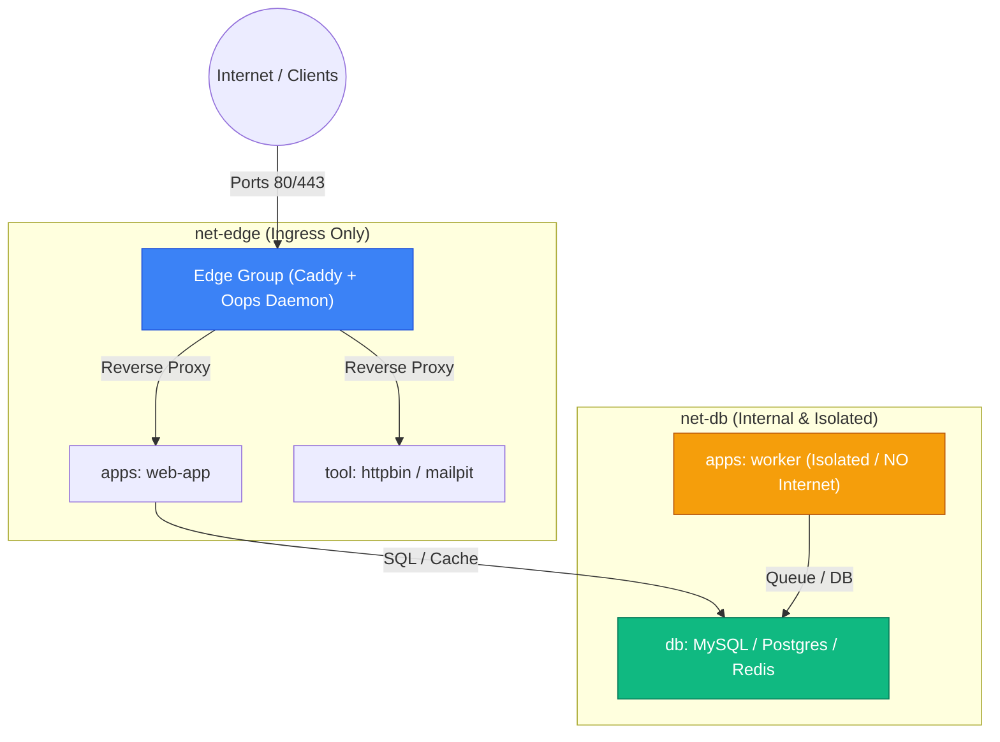

# Oopsbox Blueprint

Oopsbox is the production-ready, turnkey Infrastructure as Code (IaC) blueprint for **Oops**. It enforces **1:1 Dev-to-Prod Parity** across local developer workstations (macOS / Linux) and production servers, while enabling fully **Git-driven infrastructure updates** with zero manual SSH configuration editing.

## Directory Topology

```text
~/oopsbox/                # Standard Root Directory (or /opt/oopsbox on production)
├── .env                  # Environment variables & secrets (copy from .env.example)
├── .env.example          # Credentials template (Committed)
├── oops.yml              # Center Master Config: registries, groups, backups, shared dns (Committed)
├── oopsbox.yml           # Local Workstation Engine & DNS settings (git-ignored)
├── oopsbox.yml.example   # Workstation configuration template (Committed)
├── stacks/               # All Multi-Stack Definitions (Pure IaC, Git-tracked)
│   ├── edge/             # Group: Ingress Reverse Proxy, Auto-SSL & Oops Daemon (net-edge)
│   │   ├── compose.yml
│   │   └── caddy/
│   │       └── Caddyfile
│   ├── db/               # Group: Persistence & Cache (net-db - isolated from edge)
│   │   ├── compose.yml
│   │   └── mysql/
│   │       └── my.cnf
│   ├── tool/             # Group: Development Utilities & Mocking (httpbin, mailpit)
│   │   └── compose.yml
│   └── apps/             # Group: Application Services (web-app, worker)
│       └── compose.yml
├── bin/                  # Workstation Dev Tooling (macOS/Linux - Excluded on Prod)
│   ├── oopsbox           # Main Dispatcher (Auto-detects OS)
│   ├── oopsbox-mac       # macOS Helper (VM engine, firewall, routes, keychain cert)
│   └── oopsbox-linux     # Linux Desktop Helper
├── data/                 # Live realtime container storage (High-IOPS persistent volume)
│   ├── mysql/            # MySQL storage
│   ├── postgres/         # PostgreSQL storage
│   ├── caddy/            # SSL certificates
│   └── oops/             # Oops Daemon runtime data
│       └── dns.records   # Local Node Custom DNS Records
└── backups/              # Secondary backup storage (Cold storage / database dumps)
```

---

## Network Segmentation & Security

Oops Stack enforces the **Principle of Least Privilege & Network Isolation**:



- **`net-edge`**: Public Ingress traffic only. Databases and background workers are **never** joined to this network.
- **`net-db`**: Internal private network for persistence and cache. Completely isolated from the internet and Reverse Proxy.
- **Private Services (e.g. `worker`)**: Joined strictly to `net-db`. Cannot be accessed or probed from the external web.

---

## Quickstart (Local Development)

### One-Command Setup (`./bin/oopsbox install`)
Run the automated installation to initialize credentials, storage, macOS DNS resolver, and register `oopsbox` to global PATH:
```bash
./bin/oopsbox install
```

### Start Dev Environment (`oopsbox start`)
Starts VM routing (if using Colima) and boots the default profile (`profiles.default` in `oops.yml`):
```bash
oopsbox start
```

### Install Trusted Local SSL Certificate (`oopsbox install-cert`)
Adds Caddy's local root CA certificate to macOS Keychain (enables green lock for `https://*.web.oops`):
```bash
oopsbox install-cert
```

### Switch Active Oopsbox (`oopsbox switch <path>`)
Seamlessly switch between multiple isolated organization workspaces without port or container name collisions:
```bash
oopsbox switch ~/Workspaces/another-org/oopsbox
```

---

## Unified Configuration (`oops.yml`)

Define custom profiles, registry aliases, and shared DNS in `oops.yml`:

```yaml
registries:
  gar: asia-southeast1-docker.pkg.dev/my-project/my-repo
  noyzilla: ghcr.io/noyzilla
  hub: docker.io/myorg

profiles:
  default:    # Default daily development: Edge Router & DNS
    - /edge

  # Example custom project profile:
  # lab:
  #   - /edge
  #   - mysql
  #   - redis
  #   - web-app

dns:
  upstreams:
    - 1.1.1.1:53
    - 8.8.8.8:53
  records:
    # - api.internal 10.0.0.5
    # - .staging.oops 10.0.0.10
```

Use `@group` syntax with any `oops` command:
```bash
oops up                     # Starts default group (@default)
oops up @all                # Starts all stacks dynamically (built-in engine discovery)
oops up /edge               # Starts Edge Perimeter only
oops up /db                 # Starts Databases
oops stop @all
oops restart /edge

# Switch active profile (starts target profile & stops all other running services):
oops switch /edge
oops switch @default

# Stop all services except specified exclusions:
oops stop -x /edge
oops stop -x /edge -x redis
```

---

## DNS Management CLI (`oops dns`)

Inspect, query, and manage DNS resolution directly:
```bash
# List all active DNS records (Custom, Infra, and Container Services)
oops dns
oops dns list

# Query resolved IP for a domain
oops dns get host.oops
oops dns get mysql.oops

# Set or update a custom record (upsert)
oops dns set my-app.test 127.0.0.1
oops dns set .wild.test 192.168.1.100

# Delete a custom record
oops dns del my-app.test

# Validate and reload daemon DNS table
oops dns reload
```

---

## Global Oops CLI Usage

You can also use `oops` natively or via container alias from any directory:

```bash
# Set up Host Alias in ~/.zshrc or ~/.bashrc:
alias oops='docker run --rm -it \
  -v /var/run/docker.sock:/var/run/docker.sock \
  -v "$HOME/oopsbox":"$HOME/oopsbox" \
  -w "$HOME/oopsbox" \
  ghcr.io/noyzilla/oops:latest'

# Pull images across all stacks, specific group, or registry alias
oops pull --all
oops pull @default
oops pull gar/my-app:v1.0.0

# Start service groups or stacks
oops up                     # Starts default profile (@default)
oops up @all                # Starts all stacks
oops up /edge               # Starts Edge Perimeter (Caddy + Oops DNS)
oops up /db                 # Starts Databases (MySQL, Postgres, Redis)
oops up /tool               # Starts Dev Tools (httpbin, mailpit)
oops up /apps               # Starts Applications

# Target specific services or wildcard
oops up mysql
oops up /db/mysql
oops up httpbin
oops up mailpit
oops up app..

# Switch profiles and stop other services
oops switch /edge
oops stop -x /edge
```

---

## Stack Operations

### Sequential Rolling Updates (Zero Downtime)
Deploy updates across apps sequentially with automated health check polling:
```bash
oops update app.. -d 2s
oops update app1
oops update --image gar/my-app:v1.0.0
```

### Database Provisioning & Password Management
Create databases, dedicated users, and rotate passwords (auto-generates 20-character secure passwords when omitted):
```bash
# MySQL
oops db mysql create myapp_db myapp_user            # Auto-generates password
oops db mysql:mysql-analytics create report_db user # Target specific container
oops db mysql passwd myapp_user                     # Rotate password (auto-generates new)
oops db mysql passwd myapp_user myNewPass123        # Set explicit password
oops db mysql list
oops db mysql drop myapp_db myapp_user

# PostgreSQL
oops db pg create myapp_db myapp_user               # Auto-generates password
oops db pg:pg-custom create analytics_db user       # Target specific container
oops db pg passwd myapp_user                        # Rotate password (auto-generates new)
oops db pg list
oops db pg drop myapp_db myapp_user
```

### Automated Backup Suite (Database & Data Volumes)
Execute automated database dumps, filesystem data packaging, and prune expired archives older than `retention` (default `7d`):
```bash
# Full System Backup (Database Dumps + Data Volumes)
oops backup                         # Full backup (DB + Data) and prune expired
oops backup prune                   # Prune all expired archives (no dump)

# Database Backup Only (MySQL, PostgreSQL)
oops backup-db                      # Backup all databases
oops backup-db mysql                # Backup specific database
oops backup-db postgres -r 14d      # Backup with custom 14-day retention
oops backup-db prune                # Prune expired DB dump archives

# Data Volumes & Filesystem Backup Only (Uploads, Storage, Certs)
oops backup-data                    # Backup all targets defined in oops.yml
oops backup-data uploads            # Backup specific data target
oops backup-data prune              # Prune expired data volume archives
```

### Webhook Automation (CI/CD)
Trigger deployments from GitHub Actions or GitLab CI via the Webhook Engine:
```bash
curl -X POST https://webhook.yourdomain.com/deploy \
  -H "X-Oops-Token: your_secret_token" \
  -H "Content-Type: application/json" \
  -d '{"target": "app..", "mode": "image"}'
```
