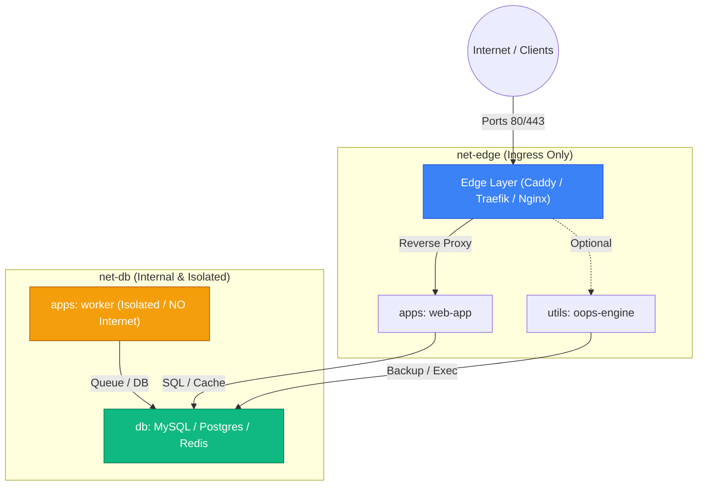

# Oops Stack Blueprint Template

This blueprint provides a production-ready, modular 4-layer Docker Compose stack designed for orchestration via **Oops** (`ghcr.io/noyzilla/oops:latest`).

## Directory Topology

```text
my-stack/
├── .env                  # Environment variables & secrets (copy from .env.example)
├── edge/                 # Layer: Ingress Reverse Proxy & Auto-SSL (net-edge)
│   └── docker-compose.yml
├── db/                   # Layer: Persistence & Cache (net-db - isolated from edge)
│   └── docker-compose.yml
├── apps/                 # Layer: Application Services (web-app: net-edge+net-db, worker: net-db only)
│   └── docker-compose.yml
└── utils/                # Layer: Oops Webhook Engine & Utilities (net-edge+net-db)
    └── docker-compose.yml
```

---

## Network Segmentation & Security

Oops Stack enforces the **Principle of Least Privilege & Network Isolation**:



- **`net-edge`**: Public Ingress traffic only. Databases and background workers are **never** joined to this network.
- **`net-db`**: Internal private network for persistence and cache. Completely isolated from the internet and Reverse Proxy.
- **Private Services (e.g. `worker`)**: Joined strictly to `net-db`. Cannot be accessed or probed from the external web.

---

## Quickstart

### 1. Configure Environment
```bash
cp .env.example .env
# Edit .env and set secure values for OOPS_SECRET and database passwords
```

### 2. Manage Stack with Oops CLI
Use Oops natively or via the container alias:

```bash
# Set up Host Alias (for COS or minimal Linux environments):
alias oops='docker run --rm -it \
  -v /var/run/docker.sock:/var/run/docker.sock \
  -v "$PWD":/work \
  -w /work \
  ghcr.io/noyzilla/oops:latest'

# Start entire stack
oops up

# Start specific layers (in dependency order)
oops up edge
oops up db
oops up utils
oops up apps

# Start specific services or glob pattern
oops up mysql
oops up "app*"
```

---

## Stack Operations

### Sequential Rolling Updates (Zero Downtime)
Deploy updates across apps sequentially with automated health check polling:
```bash
oops update "app*"
oops update app1
```

### Database Provisioning & Password Management
Create databases, dedicated users, and rotate passwords (auto-generates 20-character secure passwords when omitted):
```bash
# MySQL
oops db mysql create myapp_db myapp_user            # Auto-generates password
oops db mysql:mysql-analytics create report_db user # Target specific container
oops db mysql passwd myapp_user                     # Rotate password (auto-generates new)
oops db mysql passwd myapp_user myNewPass123        # Set explicit password
oops db mysql list
oops db mysql drop myapp_db myapp_user

# PostgreSQL
oops db pg create myapp_db myapp_user               # Auto-generates password
oops db pg:pg-custom create analytics_db user       # Target specific container
oops db pg passwd myapp_user                        # Rotate password (auto-generates new)
oops db pg list
oops db pg drop myapp_db myapp_user
```

### Database Backup & Retention
Execute automated dumps and prune archives older than `BACKUP_RETENTION_DAYS`:
```bash
oops backup
oops backup mysql
oops backup postgres
```

### Webhook Automation (CI/CD)
Trigger deployments from GitHub Actions or GitLab CI via the Webhook Engine:
```bash
curl -X POST https://webhook.yourdomain.com/deploy \
  -H "X-Oops-Token: your_secret_token" \
  -H "Content-Type: application/json" \
  -d '{"target": "app*", "mode": "image"}'
```
